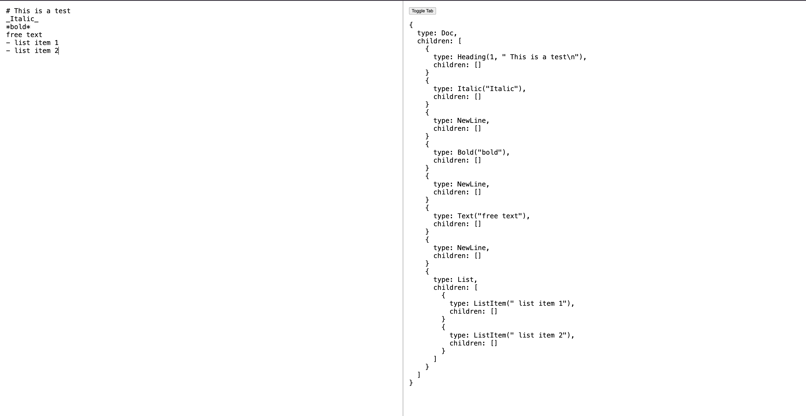
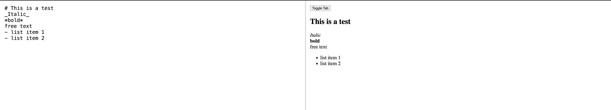

# John Crickett Coding Challenge - Markdown Parser

[Article](https://codingchallenges.substack.com/p/coding-challenge-82-markdown-to-pdf)

## Technologies

Rust - used for the parser
Wasm - parser is compiled to wasm for use in browser
Svelte - used for the UI

## Running the project

Run the `start.sh` script in the root of the project.

## Features

This project is unfinished for now, but it currently supports:

- headings (no boundary check on heading priority)
- bold
- italic
- unordered list
- free text

It parses the characters and constructs an AST, which looks something like this:

And also renders the HTML:

